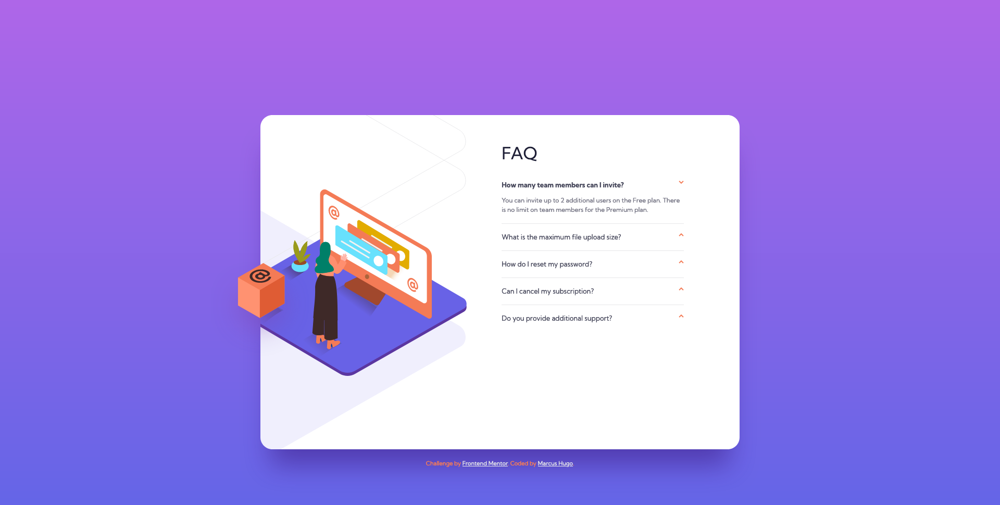

# Frontend Mentor - FAQ accordion card solution

This is a solution to the [FAQ accordion card challenge on Frontend Mentor](https://www.frontendmentor.io/challenges/faq-accordion-card-XlyjD0Oam). Frontend Mentor challenges help you improve your coding skills by building realistic projects. 

## Table of contents

- [Overview](#overview)
  - [The challenge](#the-challenge)
  - [Screenshot](#screenshot)
  - [Links](#links)
- [My process](#my-process)
  - [Built with](#built-with)
  - [What I learned](#what-i-learned)
  - [Continued development](#continued-development)
  - [Useful resources](#useful-resources)
- [Author](#author)
- [Acknowledgments](#acknowledgments)


## Overview

### The challenge

Users should be able to:

- View the optimal layout for the component depending on their device's screen size
- See hover states for all interactive elements on the page
- Hide/Show the answer to a question when the question is clicked

### Screenshot




### Links

- Solution URL: [https://github.com/marcus-hugo/faq-accordion-card-main](https://github.com/marcus-hugo/faq-accordion-card-main)

- Live Site URL: [https://marcus-hugo.github.io/faq-accordion-card-main/](https://marcus-hugo.github.io/faq-accordion-card-main/)

## My process

### Built with

- Semantic HTML5 markup
- CSS custom properties
- Flexbox
- Mobile-first workflow
- JavaScript

### What I learned

- First time building an accordion. It was a lot of fun!  I found out there are many ways to build an accordion with HTML and CSS, but, I chose to go with JavaScript.  Thought this would be a great way to practice writing JavaScript. Using the `.toggle()` method seemed the most straightforward way.

```js 
this.classList.toggle('active');
panel.classList.toggle('active');
icon.classList.toggle('active');
```

- How to add, layer, and position two background images usding different
`background:` properties.

```css 
background-image: url(../images/illustration-woman-online-desktop.svg), url(../images/bg-pattern-desktop.svg);
background-position:  -76px, -571px -248px;
background-size: 472px, 966px;
background-repeat: no-repeat; 
```
- I ran into a 404 error with the background images `urls()`, it seems that
adding `../` was the only way the files were found, though locally
just adding the `/` the files would display.  I guess `../` is more specific?


### Continued development


### Useful resources
- https://codepen.io/kathykato/pen/MoZJom for only showing the current accordion
panel when clicked.

- reading more about `aria-expanded` https://developer.mozilla.org/en-US/docs/Web/Accessibility/ARIA/Attributes/aria-expanded


## Author

- Website - [Add your name here](https://www.your-site.com)
- Frontend Mentor - [@marcus-hugo](https://www.frontendmentor.io/profile/marcus-hugo)


## Acknowledgments

